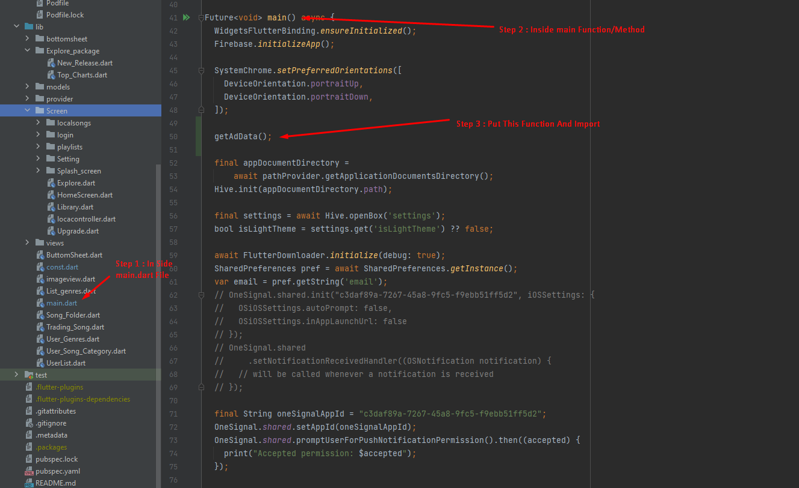
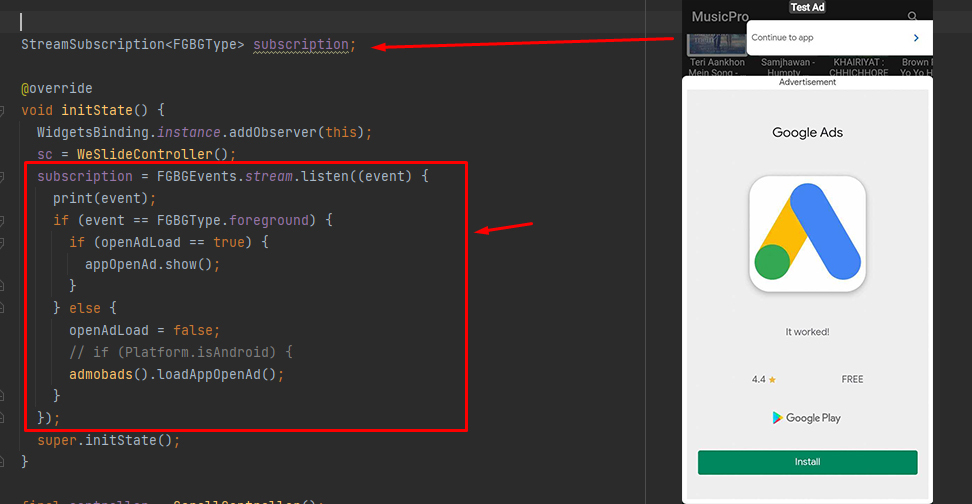
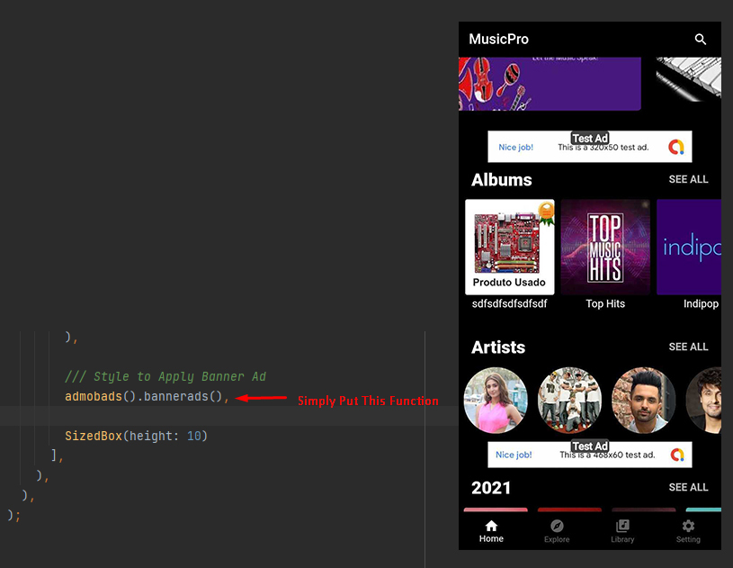
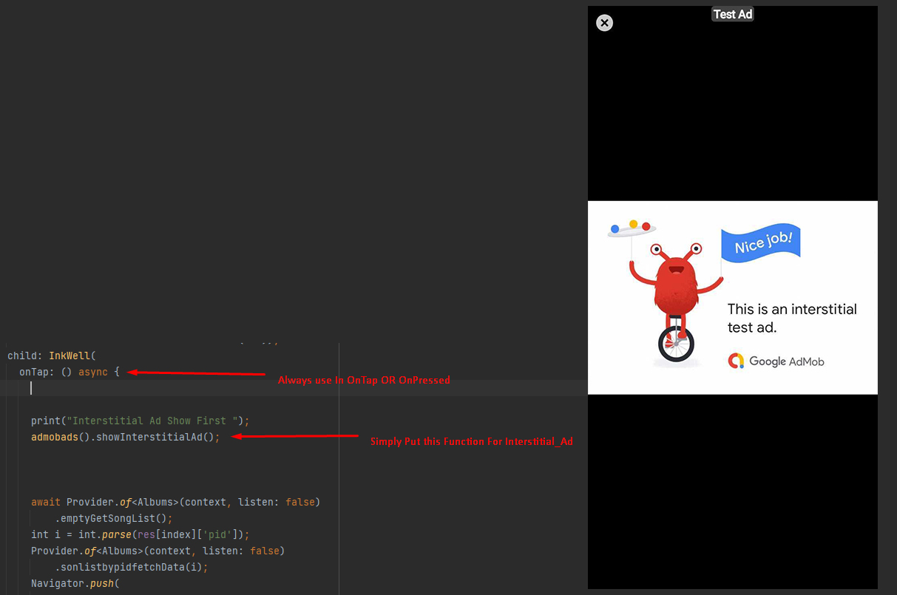

# Flutter-Ads-Class-And-Usage
## How to  Apply Ads In Flutter And Proper Use of It.

+ Step : 1 -- Add Dependency In `pubspec.yaml`
```dart
google_mobile_ads: ^1.3.0    // <-- Always Check Were There Version Is Latest Or Not 
```
+ Step : 2 -- Create **`ads_constant.dart`** File And Paste beloved code

```dart
import 'dart:convert';
import 'dart:io';
import 'package:flutter/material.dart';
import 'package:http/http.dart' as http;
import 'package:google_mobile_ads/google_mobile_ads.dart';

String getBannerAdUnitId() {
  if (Platform.isIOS) {
    return 'ca-app-pub-7142055990921479/8864591791';
  } else if (Platform.isAndroid) {
    return 'ca-app-pub-3940256099942544/6300978111';
  }
  return null;
}

String bannerIOS = '';
String bannerAndroid = '';
String interstitialAndroid = '';
String interstitialIOS = '';
String openAdIdAndroid = '';
String openAdIdIOS = '';
InterstitialAd interstitialAd;
bool openAdLoad = false;

AppOpenAd appOpenAd;
bool _isShowingAd = false;

getAdData() async {
  MobileAds.instance.initialize();
  try {
    final request = http.MultipartRequest(
        'POST',
        Uri.parse(
            'https://vocsyinfotech.in/envato/cc/flutter_musicplayer/api.php'));
    request.fields['data'] = '{"method_name":"app_details"}';
    http.Response response =
        await http.Response.fromStream(await request.send());

    if (response.statusCode == 200) {
      var finalres = json.decode(response.body);
      print("Data Of Download : ${finalres}");
    }

    if (response.statusCode == 200) {
      var finalres = json.decode(response.body);
      bannerIOS = finalres['ONLINE_MP3'][0]['ios_banner_ad_id'];

      bannerAndroid = finalres['ONLINE_MP3'][0]['banner_ad_id'];

      interstitialAndroid = finalres['ONLINE_MP3'][0]['interstital_ad_id'];

      interstitialIOS = finalres['ONLINE_MP3'][0]['ios_interstital_ad_id'];

      openAdIdAndroid = finalres['ONLINE_MP3'][0]['app_open_ad_id'];
      openAdIdIOS = finalres['ONLINE_MP3'][0]['ios_app_open_ad_id'];
    } else {
      print("Response of body ==${null}");
    }

    admobads().loadAppOpenAd();
    admobads().createInterstitialAd();
  } catch (e) {
    print('error in get data $e');
  }
}

String interstitalAd() {
  if (Platform.isIOS) {
    return interstitialIOS;
  } else if (Platform.isAndroid) {
    return interstitialAndroid;
    // return "ca-app-pub-3940256099942544/1033173712";
  }
  return null;
}

String openAd() {
  if (Platform.isIOS) {
    return openAdIdIOS;
  } else if (Platform.isAndroid) {
    return openAdIdAndroid;
  }
  return null;
}

class admobads {
  Widget bannerads() {
    final googleBannerAd = BannerAd(
      adUnitId: getBannerAdUnitId(),
      size: AdSize.banner,
      listener: const BannerAdListener(),
      request: AdRequest(),
    )..load();
    return Container(
      color: Colors.black12,
      alignment: Alignment.bottomCenter,
      width: googleBannerAd.size.width.toDouble(),
      height: googleBannerAd.size.height.toDouble(),
      child: AdWidget(ad: googleBannerAd),
    );
  }

  loadAppOpenAd() {
    AppOpenAd.load(
        adUnitId: openAd(), //Your ad Id from admob
        request: const AdRequest(),
        adLoadCallback: AppOpenAdLoadCallback(
            onAdLoaded: (ad) {
              appOpenAd = ad;
              openAdLoad = true;
              print('open add loaded $openAdLoad');
            },
            onAdFailedToLoad: (error) {}),
        orientation: AppOpenAd.orientationPortrait);
  }

  /// Interstitial Ads

  int maxFailedLoadAttempts = 3;

  static final AdRequest request = AdRequest(
    keywords: ['foo', 'bar'],
    contentUrl: 'http://foo.com/bar.html',
    nonPersonalizedAds: true,
  );

  InterstitialAd createInterstitialAd() {
    try {
      InterstitialAd.load(
          adUnitId: interstitalAd(),
          request: request,
          adLoadCallback: InterstitialAdLoadCallback(
            onAdLoaded: (InterstitialAd ad) {
              interstitialAd = ad;
              print('add loaded');
              // _interstitialAd = ad;
            },
            onAdFailedToLoad: (LoadAdError error) {
              print('add loaded error $error');
            },
          ));
    } catch (e) {
      print('add loaded error $e');
    }
  }

  /// Over Interstitial Ads

  /// Show IntertitialAd
  void showInterstitialAd() {
    if (interstitialAd == null) {
      print('Warning: attempt to show interstitial before loaded.');
      return;
    }
    interstitialAd.fullScreenContentCallback = FullScreenContentCallback(
      onAdShowedFullScreenContent: (InterstitialAd ad) =>
          print('ad onAdShowedFullScreenContent.'),
      onAdDismissedFullScreenContent: (InterstitialAd ad) {
        print('$ad onAdDismissedFullScreenContent.');
        ad.dispose();
        createInterstitialAd();
      },
      onAdFailedToShowFullScreenContent: (InterstitialAd ad, AdError error) {
        print('$ad onAdFailedToShowFullScreenContent: $error');
        ad.dispose();
        createInterstitialAd();
      },
    );
    interstitialAd.show();
    interstitialAd = null;
  }
}

```

+ Step : 3 -- In `main.dart` File Paste This Line.
```dart
getAdData(); // <-- Add This Line For Initialize Ads
```
### Example Image


+ Step : 4 -- In your First StateFullWidget Class In InitState Add This Line.
```dart
WidgetsBinding.instance.addObserver(this);
```
+ Step : 5.1 -- Add Dependency in Your `pubspec.yaml`
```dart
flutter_fgbg: ^0.2.0
```
+ Step : 5.2 -- In your First StateFullWidget Class Add This Function Above InitState.
```dart
StreamSubscription<FGBGType> subscription;
```
+ Step : 5.3 -- In your First StateFullWidget Class Add This Function In InitState.
```dart
    subscription = FGBGEvents.stream.listen((event) {
      print(event);
      if (event == FGBGType.foreground) {
        if (openAdLoad == true) {
          appOpenAd.show();
        }
      } else {
        openAdLoad = false;
        // if (Platform.isAndroid) {
        admobads().loadAppOpenAd();
      }
    });
```
### Example Image


+ Step : 6 -- Now For Add Banner Ad Simply Call Function Like This.
```dart
admobads().bannerads(),
```
### Example Image


+ Step : 6 -- Now For Add Banner Ad Simply Call Function Like This.
```dart
admobads().showInterstitialAd();
```
### Example Image

